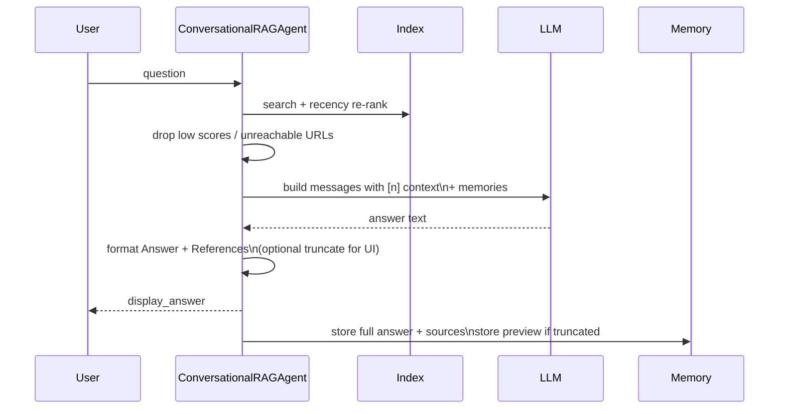

# AI Knowledge Crawler & RAG Agent

## System at a Glance
- **Crawler**: Async, domain-limited crawl with heuristic + optional LLM judging, polite delays, UA rotation, robots.txt respect, and fallback to `requests` when `aiohttp` fails.
- **Storage**: Captured pages in `data/pages.jsonl` (deduped appends), long-term reflections in `data/memory_longterm.jsonl`, logs in `logs/`.
- **Indexing**: SentenceTransformer embeddings on GPU when available; chunks with overlap and minimum-word filtering.
- **Chat**: Retrieval + recency re-rank + URL validation, produces fact-cited answers with a sources block; full answers persisted to memory even if display is truncated.

## Crawl Workflow
```mermaid
flowchart LR
    Seeds[Seed URLs\n(default AI lab blogs)] --> Queue
    Queue -->|concurrent| Fetch[aiohttp fetch\n+ UA rotation]
    Fetch --> Clean[Parse & clean HTML]
    Clean --> Filter[Heuristic keywords\n+ optional LLM judge\n+ verification]
    Filter -->|skip| Reflexion[Reflexion note -> memory]
    Filter -->|keep| Persist[Write JSONL (dedup)]
    Persist --> Links[Extract links\nwithin allowed domains]
    Links --> Queue
    Fetch -.fallback on error.-> Sync[requests.get fallback]
```

Notes:
- Short pages are kept at depth 0 (seeds) to allow link expansion; deeper pages under 60 words are skipped with a reflexion note.
- Deduped writes: previously saved URLs are not re-saved, but seeds are always re-visited for fresh links.
- Crawl summary logs include visited/kept/skipped counts and output path.

## RAG / Chat Workflow


Answer format:
- Prefixed with `Answer:`
- Inline citations like `[1]`
- References block with numbered titles, URLs, and `fetched_at`

## Data Files
- `data/pages.jsonl`: Captured pages; deduped appends.
- `data/index.pkl.gz`: Embeddings index.
- `data/memory_longterm.jsonl`: Reflections and conversations (full answers saved, even if UI truncates).
- `logs/`: Crawl logs (if enabled externally).

## Key Parameters (CLI)
- Crawl: `--max-pages`, `--depth`, `--concurrency`, `--delay`, `--judge-llm {ollama|openai|none}`, `--judge-model`, `--judge-openai-model`, `--output`.
- Index: `--model`, `--chunk-size`, `--overlap`, `--min-words`.
- Chat: `--top-k`, `--llm`, `--ollama-model`, `--openai-model`.

For custom UI truncation in code, set `display_char_limit` when instantiating `ConversationalRAGAgent` (full answers are always persisted). 
