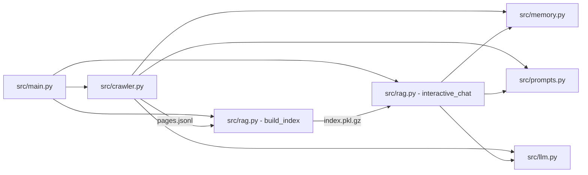
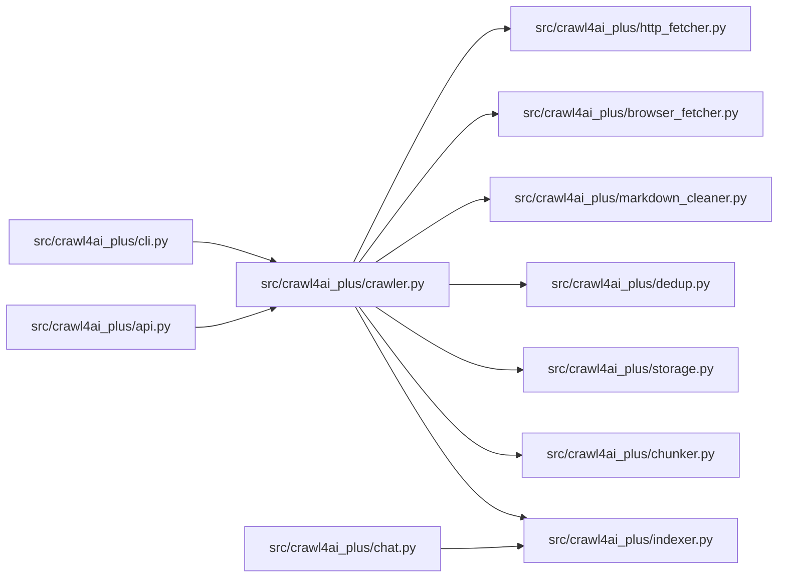
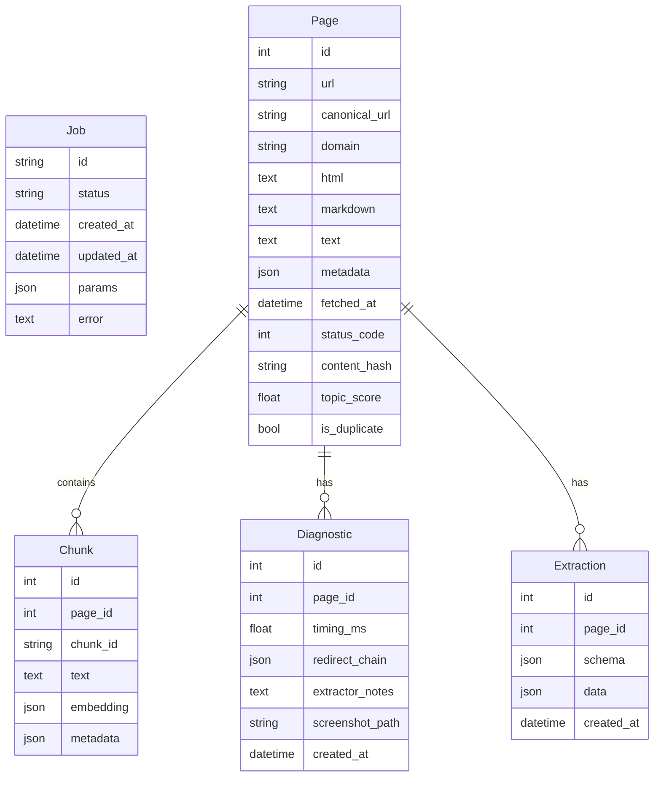
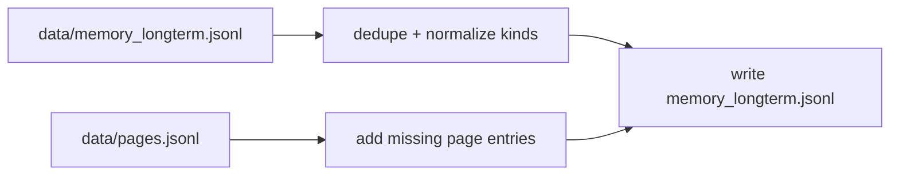

# Module Reference (src and scripts)

This document is a detailed, module-by-module reference for the code in `src/` and `scripts/`.
It explains what each module does, how it works internally, and how the modules fit together.
Charts are included to visualize the main flows.

## System Map (src stack)

## System Map (crawl4ai_plus stack)

## Storage Schema (crawl4ai_plus)

## src/main.py
Role: CLI entrypoint for the lightweight crawler + RAG stack.

Key responsibilities:
- Defines `crawl`, `index`, `chat`, and `search` subcommands.
- Converts CLI flags to Python arguments for `src/crawler.py` and `src/rag.py`.
- Initializes logging for the process.

How it works:
- `make_parser()` wires flags to defaults like `DEFAULT_SEEDS` and `rag.DEFAULT_MODEL`.
- `main()` dispatches to:
  - `crawler.crawl(...)` for crawling and writing `data/pages.jsonl`.
  - `rag.build_index(...)` for building `data/index.pkl.gz`.
  - `rag.interactive_chat(...)` for an interactive RAG shell.
  - `rag.search(...)` to print matching chunks without LLM generation.

Inputs and outputs:
- Input: CLI flags, seed URLs, LLM backend settings.
- Output: JSONL pages, gzip pickled index, console chat/search output.

Failure modes:
- Any raised exception stops the CLI; no retry logic here (the crawler handles retries).

## src/crawler.py
Role: Async crawler with heuristic filtering, optional LLM judging, and reflexion logging.

Key structures:
- `Page`: dataclass for persisted page payloads.
- `RobotsCache`: caches robots.txt rules per domain.
- `ReflexionLogger`: writes skip reasons into long-term memory.
- `DomainJudge`: combines heuristic scoring + optional LLM judge/verify.
- `AsyncCrawler`: main crawl loop and persistence logic.

How it works (step-by-step):
1. Seeds are loaded and expanded using `discover_news_seeds()` if enabled.
2. `AsyncCrawler.crawl()` maintains a BFS queue with depth tracking and concurrency limits.
3. Each URL is processed by `_process_url()`:
   - Rejects duplicates, depth overflow, disallowed domains, and robots.txt blocks.
   - Fetches HTML with `aiohttp`, with user-agent rotation and retry/backoff for 403/429.
   - Falls back to `requests.get()` if async fetch fails or returns empty.
   - Cleans HTML into plain text and title via `clean_text()`.
   - Skips short pages under 60 words at depth > 0 (but keeps short seeds).
   - Computes `heuristic_relevance_score()` over keywords, domain terms, eval terms, and datasets.
   - Uses `DomainJudge.judge()`:
     - Heuristic score >= 2 -> keep.
     - No LLM -> keep if score > 0.
     - LLM -> prompt from `prompts.build_judge_prompt()`.
   - Optional verification prompt if heuristic score > 0 but LLM says skip.
   - Extracts new links from HTML for next depth.
   - Persists new pages to JSONL with dedupe.
4. Keeps summary stats for logs (visited, kept, skipped).

Important helpers:
- `discover_news_seeds()`: DuckDuckGo HTML search with `uddg` decoding and extension filtering.
- `should_visit()`: enforces allowed domains and file extension filtering.
- `load_existing()`: loads previously saved URLs to avoid re-saving.
- `save_page()`: JSONL append with UTF-8 output.

Data outputs:
- `data/pages.jsonl` (deduped by URL)
- `data/memory_longterm.jsonl` (reflexion notes about skips)

Error handling:
- Network errors log reflexion notes and skip.
- Robots.txt failures default to allow to avoid hard failure.
- LLM call failures return a default and fall back to heuristics.

## src/rag.py
Role: Builds a vector index, runs retrieval, and generates answers via LLM.

Core data types:
- `Chunk`: dataclass containing text + metadata for retrieval.

Indexing pipeline:
1. `load_pages()` reads `data/pages.jsonl`.
2. `chunk_text()` splits pages by word counts with overlap.
3. `build_index()`:
   - Filters short pages and short chunks.
   - Embeds all chunks with SentenceTransformer.
   - Stores embeddings + chunks in a gzip pickle (`data/index.pkl.gz`).

Retrieval and answer pipeline:
1. `search_index()` embeds the query and ranks by dot product.
2. `ConversationalRAGAgent.retrieve()`:
   - Over-fetches top results, then rescales with a recency bonus.
   - Filters low scores and (for XAI queries) filters out non-XAI chunks.
   - Optionally fetches live news snippets if:
     - no relevant results, or
     - query indicates recency, or
     - top result is older than 45 days.
   - Merges, dedupes by URL, and optionally validates URLs with `HEAD`.
3. `ConversationalRAGAgent.answer()`:
   - Builds prompts with `prompts.build_answer_system_prompt()`.
   - Includes long-term reflexions + short-term conversation memory.
   - Stores full answer in long-term memory; optional display truncation.

Live news path:
- `LiveNewsFetcher`:
  - Uses DuckDuckGo HTML search to find URLs.
  - Downloads and cleans each page.
  - Embeds the snippets and merges with static index results.

Failure modes:
- If no results or all low-score results, returns a fallback message.
- URL validation can drop all results if all links are down.

## src/llm.py
Role: LLM backend adapter with a single `chat()` entry point.

How it works:
- `LLMClient.chat()` switches between:
  - `ollama` via `ollama.chat(...)`
  - `openai` via `OpenAI().chat.completions.create(...)`
- `safe_llm_call()` wraps calls and returns a default string on failure.

Key behavior:
- OpenAI requires `OPENAI_API_KEY` in the environment.
- `model` and `openai_model` are separate to allow split config.

## src/memory.py
Role: Lightweight JSONL memory store for long-term notes + short-term turns.

Components:
- `MemoryEntry`: dataclass serialized into JSONL.
- `MemoryStore`:
  - Loads existing JSONL at startup.
  - `add()` appends entries to disk and memory.
  - `recent()` fetches recent entries by kind.
- `ShortTermMemory`:
  - Sliding window of recent conversation turns.

Persistence:
- Default path: `data/memory_longterm.jsonl`.

## src/prompts.py
Role: Central prompt templates for judge, verifier, and answer system behavior.

Details:
- `FOCUS_TOPICS` list defines what "on-topic" means for crawling.
- `build_judge_prompt()` asks for KEEP/SKIP/UNSURE.
- `build_verification_prompt()` asks for JSON with status and note.
- `build_answer_system_prompt()` enforces citation-only answers and no hallucination.

## src/pipeline.py
Role: Scripted pipeline to run crawl and index with logging.

How it works:
- `run_command(...)` streams subprocess output to console and log file.
- Defines `crawl_cmd` and `index_cmd` lists with CLI args.
- Writes logs to `logs/run_YYYY-MM-DD_HH-MM-SS.log`.

Notes:
- This is a wrapper around `python -m src.main ...`.
- If crawl fails, indexing never runs.

## src/smart_web_crawler.py
Role: Standalone, synchronous crawler with priority queue scheduling and richer parsing.

Core design:
- `CrawlResult`: dataclass for results, including links, images, tables, and text snippet.
- `WebCrawler`:
  - ThreadPool-based concurrency.
  - Priority queue ordered by keyword hints and depth.
  - Optional seed discovery via DuckDuckGo.
  - Relevance filter by keyword count threshold.

Important behaviors:
- `discover_new_seeds()` keeps the queue alive if it drains.
- `fetch()` uses `requests.Session` and retry adapter.
- `parse_static_content()` extracts:
  - Title and meta description
  - Links and images (absolute URLs)
  - Table text
  - A 500-char snippet
- `parse_dynamic_content()` is a placeholder for browser-based fetch.

Outputs:
- `save_results()` writes JSONL or CSV, based on `fmt`.

## src/run.bat
Role: Windows batch script to run crawl then index.

Behavior:
- Calls `py -m src.main crawl` then `py -m src.main index`.
- Stops if crawl fails, then pauses for review.

## src/__init__.py
Role: Placeholder package initializer (currently empty).

## src/crawl4ai_plus/__init__.py
Role: Package metadata and exports for the crawl4ai_plus stack.

Exports:
- `config`, `storage`, `crawler`, `http_fetcher`, `browser_fetcher`, `markdown_cleaner`,
  `chunker`, `dedup`, `indexer`, `chat`, `api`, `cli`, `cleaner`.

## src/crawl4ai_plus/api.py
Role: FastAPI server exposing crawl, status, search, and chat APIs.

Endpoints:
- `POST /crawl`: start a background crawl job.
- `GET /status/{job_id}`: job state from SQLite.
- `POST /search`: query Chroma directly.
- `POST /chat`: run RAG over Chroma and return an answer.

How it works:
- Builds `Config`, `Storage`, and `ChromaIndexer` on startup.
- Uses optional JWT header auth (configurable).
- Runs crawl in `BackgroundTasks` and returns `job_id`.

## src/crawl4ai_plus/browser_fetcher.py
Role: Playwright-based fetcher for JS-heavy pages.

Key behaviors:
- Reuses browser context and persisted cookies (`data/cookies.json`).
- Captures screenshots on error into `data/screenshots/`.
- Optional infinite scroll with time limit.

Output:
- `BrowserResult` containing HTML, status, final URL, and optional error.

## src/crawl4ai_plus/chat.py
Role: Minimal RAG chat over Chroma using Ollama.

How it works:
- `build_prompt()` formats contexts and metadata.
- `chat_once()`:
  - Calls `indexer.query(...)`.
  - Sends prompt to `ollama /api/chat` via `httpx`.
  - Returns the response content or the prompt as fallback.

## src/crawl4ai_plus/chunker.py
Role: Character-based chunking for markdown/text.

Details:
- Overlapping windows sized by characters, not words.
- Enforces a minimum chunk length (`min_size`).
- Generates deterministic `chunk_id` from SHA-256 of index + content slice.

Output:
- List of dicts: `{chunk_id, text, metadata}`.

## src/crawl4ai_plus/cleaner.py
Role: Deduplication maintenance for stored pages.

Behavior:
- `run_clean()`:
  - Marks duplicates by content hash.
  - Deletes duplicates and associated chunks.

## src/crawl4ai_plus/cli.py
Role: CLI for the crawl4ai_plus pipeline.

Commands:
- `crawl`: run a full crawl with config-based settings.
- `clean`: mark + purge duplicates.
- `reindex`: rebuild Chroma from stored markdown.
- `chat`: query and get LLM response.
- `test-crawl`: short smoke test with 2 pages.

Key flow:
- `_run_crawl()` instantiates `CrawlService` and `ChromaIndexer`.
- `_run_reindex()` iterates pages in SQLite and re-adds chunks to Chroma.

## src/crawl4ai_plus/config.py
Role: Configuration loader and schema definition.

How it works:
- Reads YAML config (default `config.yaml`).
- Expands `$ENV` variables in YAML strings.
- Applies env overrides using keys like `CRAWL_CRAWLER__MAX_PAGES=200`.
- Maps dicts into typed dataclasses (Config + sub-settings).

Key sections:
- `crawler`: seeds, max depth/pages, filtering, robots, cache.
- `browser`: Playwright options, cookies, screenshots.
- `storage`: SQLite path, markdown/raw dirs, Chroma path.
- `extraction`: CSS/XPath selectors, LLM extraction toggles.
- `index`: embedding backend and chunking settings.
- `rate_limits`: per-domain delays and circuit breaker.
- `api`, `chat`, `webhook`: service settings.

## src/crawl4ai_plus/crawler.py
Role: Full crawl orchestration with fetch, clean, dedup, index, and webhook.

Step-by-step:
1. Initializes `PoliteHttpFetcher` (HTTP) and `BrowserFetcher` (Playwright).
2. Seeds a queue and tracks per-domain counts and visited URLs.
3. Fetches HTML:
   - HTTP first, optional browser fallback if status >= 400 or empty.
4. Converts HTML to markdown + text (`html_to_markdown`).
5. Deduplication:
   - `Deduper.seen(text)` checks simhash/minhash/hashes.
   - Existing pages are detected via `Storage.save_page()` uniqueness.
6. Saves:
   - Page content, diagnostics, and optional extraction outputs.
7. Indexing:
   - Chunks markdown and stores in Chroma (unless duplicate/existing).
8. Stopping:
   - Stops at `max_pages`, `max_depth`, or if no new keywords found.
9. Webhook:
   - Optional webhook call on completion/failure.

Important heuristics:
- `relevance_score()` computes keyword hit ratio.
- `no_gain_streak` stops crawl after repeated low-info pages.
- `max_urls_per_domain` prevents domain over-crawling.

## src/crawl4ai_plus/dedup.py
Role: Content deduplication by hash, simhash, and minhash.

Key parts:
- `content_hash()` for exact dup detection.
- `simhash()` + `hamming_distance()` for near-duplicates.
- `minhash_signature()` + `jaccard_from_minhash()` for fuzzy overlap.
- `Deduper.seen()` combines all three with thresholds.

## src/crawl4ai_plus/extraction.py
Role: Structured extraction utilities.

Behavior:
- `extract_with_selectors()` uses CSS selectors and XPath.
- `extract_with_llm_stub()` returns a placeholder preview and schema echo.

## src/crawl4ai_plus/http_fetcher.py
Role: Async HTTP fetcher with caching, robots, rate limits, and circuit breaker.

How it works:
- Cache: stores JSON blobs in `cache_dir` keyed by URL hash.
- Robots: downloads and caches robots.txt per domain.
- Rate limit: per-domain lock + sleep to enforce delays.
- Retry: exponential backoff on timeouts or request errors.
- Circuit breaker: if failures exceed threshold, skip for a cool-off window.

Outputs:
- `FetchResult` with content, status, timing, cache flag, and errors.

## src/crawl4ai_plus/indexer.py
Role: ChromaDB indexer with pluggable embedding backends.

Backends:
- `SentenceTransformerBackend` for local embeddings.
- `OllamaEmbeddingBackend` for remote embeddings over HTTP.
- `HashEmbeddingBackend` for test-only deterministic vectors.

Key calls:
- `add_chunks()` upserts text, embeddings, ids, metadata.
- `query()` embeds the query and returns top matches.

## src/crawl4ai_plus/markdown_cleaner.py
Role: HTML to cleaned markdown + plain text.

Steps:
- `readability.Document` extracts the main content.
- `markdownify` converts HTML to markdown.
- `_strip_boilerplate()` removes nav, boilerplate, and low-signal lines.
- Optional BM25 filter keeps top paragraphs by relevance.

Output:
- `(cleaned_markdown, plain_text)`

## src/crawl4ai_plus/storage.py
Role: SQLite persistence with SQLAlchemy ORM models.

Key models:
- `Job`: status for crawl tasks.
- `Page`: canonical URL, HTML, markdown, text, diagnostics.
- `Chunk`: chunked text and metadata.
- `Extraction`: structured data from selectors/LLM.
- `Diagnostic`: timing, redirects, screenshots.

Storage actions:
- `save_page()` handles uniqueness on canonical URL.
- `save_chunks()` persists chunk rows.
- `mark_duplicates_by_hash()` and `purge_duplicates()` maintain hygiene.

## src/crawl4ai_plus/url_utils.py
Role: URL canonicalization and allow/deny filtering.

Highlights:
- Removes tracking query params (utm, fbclid, gclid, etc).
- Normalizes scheme, host, path, and query ordering.
- `should_crawl()` checks domain allow/deny lists and regex patterns.

## scripts/refresh_memory.py
Role: Normalize and rebuild `data/memory_longterm.jsonl` from pages.

Process:
1. Load existing memory entries and pages.
2. Drop invalid entries (missing kind/content).
3. Deduplicate by `(kind, content)`.
4. Fix entries that look like pages but have wrong kind.
5. Add missing page entries from `data/pages.jsonl`.
6. Write cleaned memory back to disk.

Output:
- Prints a summary of kept/dropped/corrected/added records.

## scripts flow

