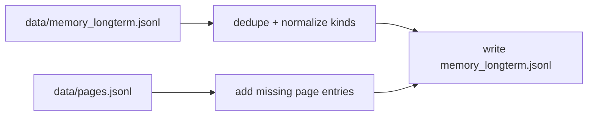

# Module Reference (scripts)

This is a directory-specific split of `docs/modules.md` for the `scripts/` tree.

## scripts/refresh_memory.py
Role: Normalize and rebuild `data/memory_longterm.jsonl` from pages.

Process:
1. Load existing memory entries and pages.
2. Drop invalid entries (missing kind/content).
3. Deduplicate by `(kind, content)`.
4. Fix entries that look like pages but have wrong kind.
5. Add missing page entries from `data/pages.jsonl`.
6. Write cleaned memory back to disk.

Output:
- Prints a summary of kept/dropped/corrected/added records.

## scripts flow

