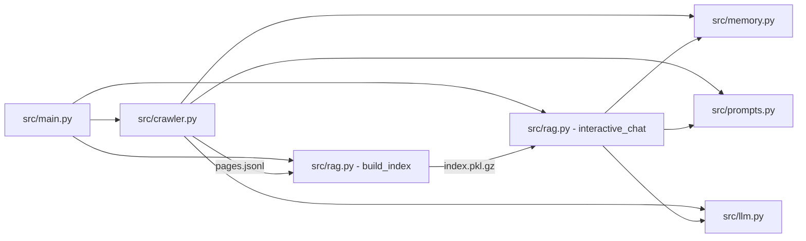

# Module Reference (src)

This is a directory-specific split of `docs/modules.md` for the `src/` tree.

## System Map (src stack)

## src/main.py
Role: CLI entrypoint for the lightweight crawler + RAG stack.

Key responsibilities:
- Defines `crawl`, `index`, `chat`, and `search` subcommands.
- Converts CLI flags to Python arguments for `src/crawler.py` and `src/rag.py`.
- Initializes logging for the process.

How it works:
- `make_parser()` wires flags to defaults like `DEFAULT_SEEDS` and `rag.DEFAULT_MODEL`.
- `main()` dispatches to:
  - `crawler.crawl(...)` for crawling and writing `data/pages.jsonl`.
  - `rag.build_index(...)` for building `data/index.pkl.gz`.
  - `rag.interactive_chat(...)` for an interactive RAG shell.
  - `rag.search(...)` to print matching chunks without LLM generation.

Inputs and outputs:
- Input: CLI flags, seed URLs, LLM backend settings.
- Output: JSONL pages, gzip pickled index, console chat/search output.

Failure modes:
- Any raised exception stops the CLI; no retry logic here (the crawler handles retries).

## src/crawler.py
Role: Async crawler with heuristic filtering, optional LLM judging, and reflexion logging.

Key structures:
- `Page`: dataclass for persisted page payloads.
- `RobotsCache`: caches robots.txt rules per domain.
- `ReflexionLogger`: writes skip reasons into long-term memory.
- `DomainJudge`: combines heuristic scoring + optional LLM judge/verify.
- `AsyncCrawler`: main crawl loop and persistence logic.

How it works (step-by-step):
1. Seeds are loaded and expanded using `discover_news_seeds()` if enabled.
2. `AsyncCrawler.crawl()` maintains a BFS queue with depth tracking and concurrency limits.
3. Each URL is processed by `_process_url()`:
   - Rejects duplicates, depth overflow, disallowed domains, and robots.txt blocks.
   - Fetches HTML with `aiohttp`, with user-agent rotation and retry/backoff for 403/429.
   - Falls back to `requests.get()` if async fetch fails or returns empty.
   - Cleans HTML into plain text and title via `clean_text()`.
   - Skips short pages under 60 words at depth > 0 (but keeps short seeds).
   - Computes `heuristic_relevance_score()` over keywords, domain terms, eval terms, and datasets.
   - Uses `DomainJudge.judge()`:
     - Heuristic score >= 2 -> keep.
     - No LLM -> keep if score > 0.
     - LLM -> prompt from `prompts.build_judge_prompt()`.
   - Optional verification prompt if heuristic score > 0 but LLM says skip.
   - Extracts new links from HTML for next depth.
   - Persists new pages to JSONL with dedupe.
4. Keeps summary stats for logs (visited, kept, skipped).

Important helpers:
- `discover_news_seeds()`: DuckDuckGo HTML search with `uddg` decoding and extension filtering.
- `should_visit()`: enforces allowed domains and file extension filtering.
- `load_existing()`: loads previously saved URLs to avoid re-saving.
- `save_page()`: JSONL append with UTF-8 output.

Data outputs:
- `data/pages.jsonl` (deduped by URL)
- `data/memory_longterm.jsonl` (reflexion notes about skips)

Error handling:
- Network errors log reflexion notes and skip.
- Robots.txt failures default to allow to avoid hard failure.
- LLM call failures return a default and fall back to heuristics.

## src/rag.py
Role: Builds a vector index, runs retrieval, and generates answers via LLM.

Core data types:
- `Chunk`: dataclass containing text + metadata for retrieval.

Indexing pipeline:
1. `load_pages()` reads `data/pages.jsonl`.
2. `chunk_text()` splits pages by word counts with overlap.
3. `build_index()`:
   - Filters short pages and short chunks.
   - Embeds all chunks with SentenceTransformer.
   - Stores embeddings + chunks in a gzip pickle (`data/index.pkl.gz`).

Retrieval and answer pipeline:
1. `search_index()` embeds the query and ranks by dot product.
2. `ConversationalRAGAgent.retrieve()`:
   - Over-fetches top results, then rescales with a recency bonus.
   - Filters low scores and (for XAI queries) filters out non-XAI chunks.
   - Optionally fetches live news snippets if:
     - no relevant results, or
     - query indicates recency, or
     - top result is older than 45 days.
   - Merges, dedupes by URL, and optionally validates URLs with `HEAD`.
3. `ConversationalRAGAgent.answer()`:
   - Builds prompts with `prompts.build_answer_system_prompt()`.
   - Includes long-term reflexions + short-term conversation memory.
   - Stores full answer in long-term memory; optional display truncation.

Live news path:
- `LiveNewsFetcher`:
  - Uses DuckDuckGo HTML search to find URLs.
  - Downloads and cleans each page.
  - Embeds the snippets and merges with static index results.

Failure modes:
- If no results or all low-score results, returns a fallback message.
- URL validation can drop all results if all links are down.

## src/llm.py
Role: LLM backend adapter with a single `chat()` entry point.

How it works:
- `LLMClient.chat()` switches between:
  - `ollama` via `ollama.chat(...)`
  - `openai` via `OpenAI().chat.completions.create(...)`
- `safe_llm_call()` wraps calls and returns a default string on failure.

Key behavior:
- OpenAI requires `OPENAI_API_KEY` in the environment.
- `model` and `openai_model` are separate to allow split config.

## src/memory.py
Role: Lightweight JSONL memory store for long-term notes + short-term turns.

Components:
- `MemoryEntry`: dataclass serialized into JSONL.
- `MemoryStore`:
  - Loads existing JSONL at startup.
  - `add()` appends entries to disk and memory.
  - `recent()` fetches recent entries by kind.
- `ShortTermMemory`:
  - Sliding window of recent conversation turns.

Persistence:
- Default path: `data/memory_longterm.jsonl`.

## src/prompts.py
Role: Central prompt templates for judge, verifier, and answer system behavior.

Details:
- `FOCUS_TOPICS` list defines what "on-topic" means for crawling.
- `build_judge_prompt()` asks for KEEP/SKIP/UNSURE.
- `build_verification_prompt()` asks for JSON with status and note.
- `build_answer_system_prompt()` enforces citation-only answers and no hallucination.

## src/pipeline.py
Role: Scripted pipeline to run crawl and index with logging.

How it works:
- `run_command(...)` streams subprocess output to console and log file.
- Defines `crawl_cmd` and `index_cmd` lists with CLI args.
- Writes logs to `logs/run_YYYY-MM-DD_HH-MM-SS.log`.

Notes:
- This is a wrapper around `python -m src.main ...`.
- If crawl fails, indexing never runs.

## src/smart_web_crawler.py
Role: Standalone, synchronous crawler with priority queue scheduling and richer parsing.

Core design:
- `CrawlResult`: dataclass for results, including links, images, tables, and text snippet.
- `WebCrawler`:
  - ThreadPool-based concurrency.
  - Priority queue ordered by keyword hints and depth.
  - Optional seed discovery via DuckDuckGo.
  - Relevance filter by keyword count threshold.

Important behaviors:
- `discover_new_seeds()` keeps the queue alive if it drains.
- `fetch()` uses `requests.Session` and retry adapter.
- `parse_static_content()` extracts:
  - Title and meta description
  - Links and images (absolute URLs)
  - Table text
  - A 500-char snippet
- `parse_dynamic_content()` is a placeholder for browser-based fetch.

Outputs:
- `save_results()` writes JSONL or CSV, based on `fmt`.

## src/run.bat
Role: Windows batch script to run crawl then index.

Behavior:
- Calls `py -m src.main crawl` then `py -m src.main index`.
- Stops if crawl fails, then pauses for review.

## src/__init__.py
Role: Placeholder package initializer (currently empty).
