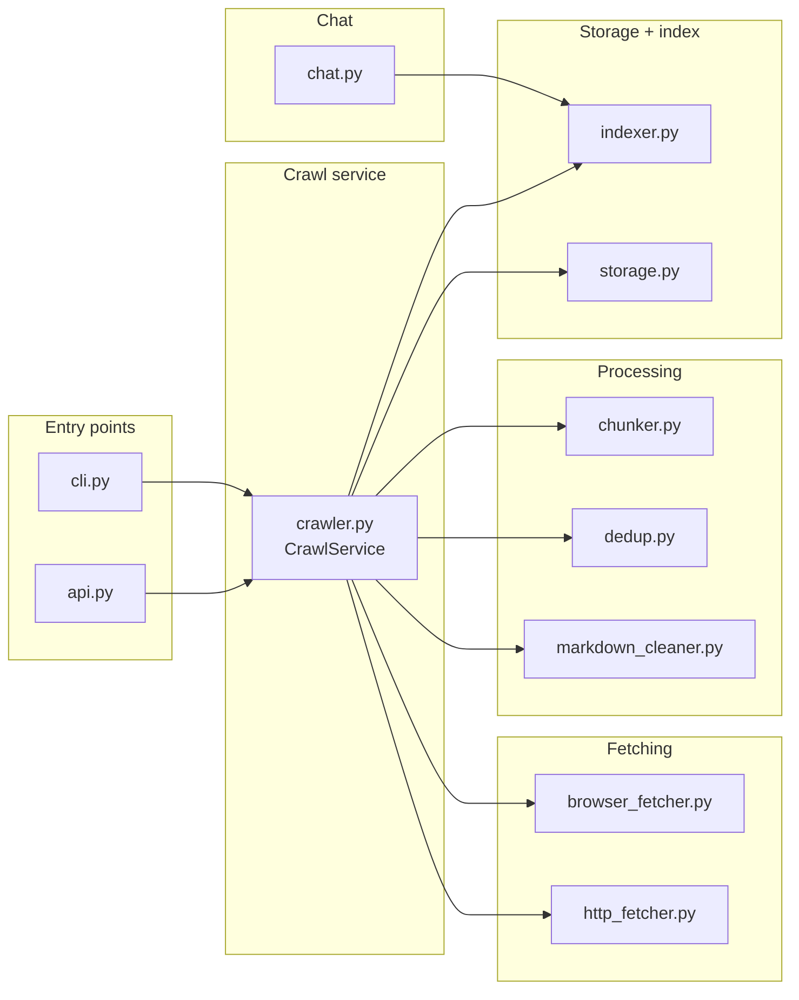
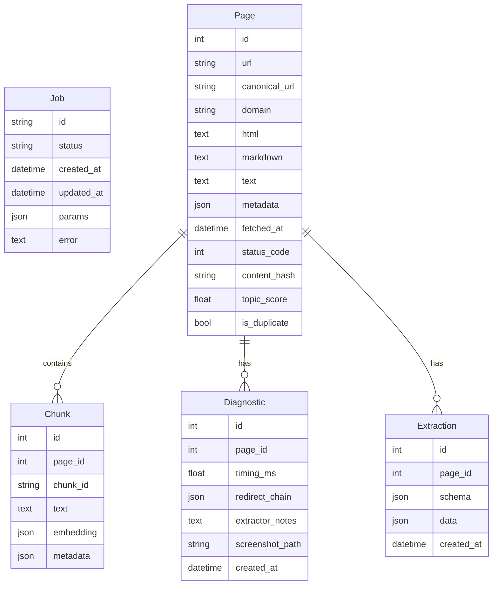

# Module Reference (src/crawl4ai_plus)

This is a directory-specific split of `docs/modules.md` for the `src/crawl4ai_plus/` tree.

## System Map (crawl4ai_plus stack)

## Storage Schema (crawl4ai_plus)

## src/crawl4ai_plus/__init__.py
Role: Package metadata and exports for the crawl4ai_plus stack.

Exports:
- `config`, `storage`, `crawler`, `http_fetcher`, `browser_fetcher`, `markdown_cleaner`,
  `chunker`, `dedup`, `indexer`, `chat`, `api`, `cli`, `cleaner`.

## src/crawl4ai_plus/api.py
Role: FastAPI server exposing crawl, status, search, and chat APIs.

Endpoints:
- `POST /crawl`: start a background crawl job.
- `GET /status/{job_id}`: job state from SQLite.
- `POST /search`: query Chroma directly.
- `POST /chat`: run RAG over Chroma and return an answer.

How it works:
- Builds `Config`, `Storage`, and `ChromaIndexer` on startup.
- Uses optional JWT header auth (configurable).
- Runs crawl in `BackgroundTasks` and returns `job_id`.

## src/crawl4ai_plus/browser_fetcher.py
Role: Playwright-based fetcher for JS-heavy pages.

Key behaviors:
- Reuses browser context and persisted cookies (`data/cookies.json`).
- Captures screenshots on error into `data/screenshots/`.
- Optional infinite scroll with time limit.

Output:
- `BrowserResult` containing HTML, status, final URL, and optional error.

## src/crawl4ai_plus/chat.py
Role: Minimal RAG chat over Chroma using Ollama.

How it works:
- `build_prompt()` formats contexts and metadata.
- `chat_once()`:
  - Calls `indexer.query(...)`.
  - Sends prompt to `ollama /api/chat` via `httpx`.
  - Returns the response content or the prompt as fallback.

## src/crawl4ai_plus/chunker.py
Role: Character-based chunking for markdown/text.

Details:
- Overlapping windows sized by characters, not words.
- Enforces a minimum chunk length (`min_size`).
- Generates deterministic `chunk_id` from SHA-256 of index + content slice.

Output:
- List of dicts: `{chunk_id, text, metadata}`.

## src/crawl4ai_plus/cleaner.py
Role: Deduplication maintenance for stored pages.

Behavior:
- `run_clean()`:
  - Marks duplicates by content hash.
  - Deletes duplicates and associated chunks.

## src/crawl4ai_plus/cli.py
Role: CLI for the crawl4ai_plus pipeline.

Commands:
- `crawl`: run a full crawl with config-based settings.
- `clean`: mark + purge duplicates.
- `reindex`: rebuild Chroma from stored markdown.
- `chat`: query and get LLM response.
- `test-crawl`: short smoke test with 2 pages.

Key flow:
- `_run_crawl()` instantiates `CrawlService` and `ChromaIndexer`.
- `_run_reindex()` iterates pages in SQLite and re-adds chunks to Chroma.

## src/crawl4ai_plus/config.py
Role: Configuration loader and schema definition.

How it works:
- Reads YAML config (default `config.yaml`).
- Expands `$ENV` variables in YAML strings.
- Applies env overrides using keys like `CRAWL_CRAWLER__MAX_PAGES=200`.
- Maps dicts into typed dataclasses (Config + sub-settings).

Key sections:
- `crawler`: seeds, max depth/pages, filtering, robots, cache.
- `browser`: Playwright options, cookies, screenshots.
- `storage`: SQLite path, markdown/raw dirs, Chroma path.
- `extraction`: CSS/XPath selectors, LLM extraction toggles.
- `index`: embedding backend and chunking settings.
- `rate_limits`: per-domain delays and circuit breaker.
- `api`, `chat`, `webhook`: service settings.

## src/crawl4ai_plus/crawler.py
Role: Full crawl orchestration with fetch, clean, dedup, index, and webhook.

Step-by-step:
1. Initializes `PoliteHttpFetcher` (HTTP) and `BrowserFetcher` (Playwright).
2. Seeds a queue and tracks per-domain counts and visited URLs.
3. Fetches HTML:
   - HTTP first, optional browser fallback if status >= 400 or empty.
4. Converts HTML to markdown + text (`html_to_markdown`).
5. Deduplication:
   - `Deduper.seen(text)` checks simhash/minhash/hashes.
   - Existing pages are detected via `Storage.save_page()` uniqueness.
6. Saves:
   - Page content, diagnostics, and optional extraction outputs.
7. Indexing:
   - Chunks markdown and stores in Chroma (unless duplicate/existing).
8. Stopping:
   - Stops at `max_pages`, `max_depth`, or if no new keywords found.
9. Webhook:
   - Optional webhook call on completion/failure.

Important heuristics:
- `relevance_score()` computes keyword hit ratio.
- `no_gain_streak` stops crawl after repeated low-info pages.
- `max_urls_per_domain` prevents domain over-crawling.

## src/crawl4ai_plus/dedup.py
Role: Content deduplication by hash, simhash, and minhash.

Key parts:
- `content_hash()` for exact dup detection.
- `simhash()` + `hamming_distance()` for near-duplicates.
- `minhash_signature()` + `jaccard_from_minhash()` for fuzzy overlap.
- `Deduper.seen()` combines all three with thresholds.

## src/crawl4ai_plus/extraction.py
Role: Structured extraction utilities.

Behavior:
- `extract_with_selectors()` uses CSS selectors and XPath.
- `extract_with_llm_stub()` returns a placeholder preview and schema echo.

## src/crawl4ai_plus/http_fetcher.py
Role: Async HTTP fetcher with caching, robots, rate limits, and circuit breaker.

How it works:
- Cache: stores JSON blobs in `cache_dir` keyed by URL hash.
- Robots: downloads and caches robots.txt per domain.
- Rate limit: per-domain lock + sleep to enforce delays.
- Retry: exponential backoff on timeouts or request errors.
- Circuit breaker: if failures exceed threshold, skip for a cool-off window.

Outputs:
- `FetchResult` with content, status, timing, cache flag, and errors.

## src/crawl4ai_plus/indexer.py
Role: ChromaDB indexer with pluggable embedding backends.

Backends:
- `SentenceTransformerBackend` for local embeddings.
- `OllamaEmbeddingBackend` for remote embeddings over HTTP.
- `HashEmbeddingBackend` for test-only deterministic vectors.

Key calls:
- `add_chunks()` upserts text, embeddings, ids, metadata.
- `query()` embeds the query and returns top matches.

## src/crawl4ai_plus/markdown_cleaner.py
Role: HTML to cleaned markdown + plain text.

Steps:
- `readability.Document` extracts the main content.
- `markdownify` converts HTML to markdown.
- `_strip_boilerplate()` removes nav, boilerplate, and low-signal lines.
- Optional BM25 filter keeps top paragraphs by relevance.

Output:
- `(cleaned_markdown, plain_text)`

## src/crawl4ai_plus/storage.py
Role: SQLite persistence with SQLAlchemy ORM models.

Key models:
- `Job`: status for crawl tasks.
- `Page`: canonical URL, HTML, markdown, text, diagnostics.
- `Chunk`: chunked text and metadata.
- `Extraction`: structured data from selectors/LLM.
- `Diagnostic`: timing, redirects, screenshots.

Storage actions:
- `save_page()` handles uniqueness on canonical URL.
- `save_chunks()` persists chunk rows.
- `mark_duplicates_by_hash()` and `purge_duplicates()` maintain hygiene.

## src/crawl4ai_plus/url_utils.py
Role: URL canonicalization and allow/deny filtering.

Highlights:
- Removes tracking query params (utm, fbclid, gclid, etc).
- Normalizes scheme, host, path, and query ordering.
- `should_crawl()` checks domain allow/deny lists and regex patterns.
