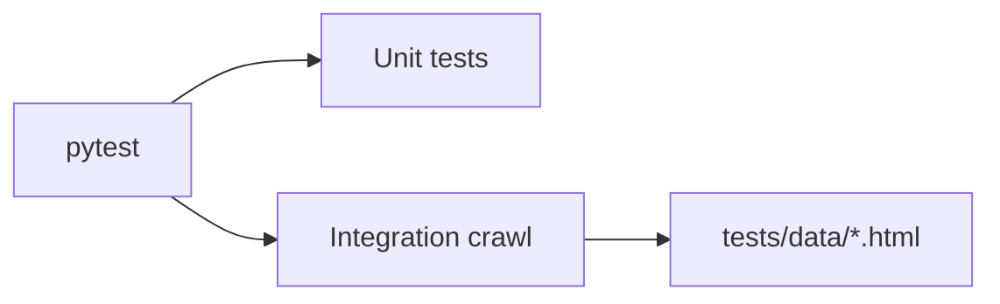

# Tests

Pytest suite for crawler utilities, config loading, and a local integration crawl.

## What is covered
- Unit checks for URL canonicalization, chunking, deduplication, and config parsing.
- Robots/rate-limit behavior and pruning heuristics.
- Local integration crawl that serves HTML from `tests/data/` and runs a short pipeline.

## How to run
```bash
py -m pytest
```

Run a single test file:
```bash
py -m pytest tests/test_integration_local_crawl.py
```

## Data fixtures
- `tests/data/` contains the static HTML pages used by the local crawl integration test.

## Test flow

